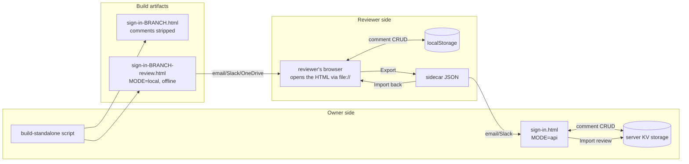
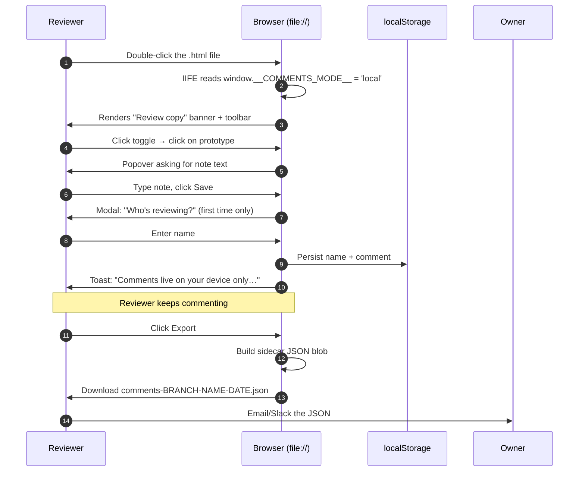

# Comment / Review System — Portable Pattern

A reusable pattern for adding **stakeholder review** to any single-page HTML prototype (or small web app) where:

- The primary product has (or could have) an online commenting backend, but
- Reviewers can't always reach it (no VPN, no hosting, external contractors, corporate firewalls), and
- The only reliable channel back and forth is passing files.

Reviewers get a **self-contained HTML file** that lets them place comments directly on the prototype offline; when done, they **Export** a small JSON sidecar and send it back; the owner **Imports** it into their working backend so everything ends up in one place.

Reference implementation lives in this repo — pointers throughout.

---

## Problem statement

Design/UX prototypes need feedback. The obvious options each have a failure mode:

| Option | Fails when |
| --- | --- |
| Live URL + server-side comments | Reviewer can't reach the URL (firewall, external partner, offline plane, etc.) |
| Screenshots + email/PDF markup | Loses prototype interactivity; comments detached from live element positions |
| Round-trip the whole HTML with comments embedded | File balloons per iteration; merging multiple reviewers' edits is manual and error-prone |
| Screen-share sync review | Doesn't scale, requires calendars, no record of feedback |

This pattern fills that gap: **one HTML file out, one small JSON file back**, no hosting required for the reviewer side, and the owner's existing backend is the source of truth.

---

## Design goals (in priority order)

1. **Reviewer needs zero setup** — double-click the HTML, comment, click Export. That's it.
2. **The HTML file itself is never modified** in the loop — comments live in `localStorage` + the exported JSON.
3. **Owner's real backend stays the single source of truth** — imported reviewer feedback is upserted into the same storage the owner already uses.
4. **Multiple reviewers merge cleanly** — each returns their own JSON; owner imports N of them without collision.
5. **The prototype code has one behavior toggle**, not two forks. Same `sign-in.html` powers both the live API mode and the offline review mode.
6. **Cross-round-tripping preserves work** — if a reviewer needs to switch machines or you send them a v2 file, they can Import their prior JSON to resume.
7. **Attribution survives the trip** — every comment records who wrote it.

---

## Architecture at a glance



Two build artifacts per branch, one runtime, one server-side backend, one JSON sidecar schema. That's the whole surface area.

---

## The runtime `MODE` flag

The comment IIFE reads three build-time globals from `window`:

```js
const MODE        = window.__COMMENTS_MODE__        || 'api';   // 'api' | 'local'
const SOURCE_HASH = window.__COMMENTS_SOURCE_HASH__ || 'dev';
const BRANCH_NAME = window.__COMMENTS_BRANCH__      || 'local';
const IS_LOCAL    = MODE === 'local';
```

Defaults preserve backwards compatibility: opening the original `sign-in.html` (no build-injected globals) runs in `api` mode exactly as before.

Every branch point in the code is a one-line `if (IS_LOCAL) return localFoo(...);` at the top of the existing `apiFoo` function — so the callers never change and the two modes stay in structural sync.

### Modes side-by-side

| Concern | `api` mode (owner) | `local` mode (reviewer) |
| --- | --- | --- |
| Persistence | `fetch('/api/comments')` → server KV | `localStorage['comments.data']` |
| Auth | Bearer token modal on first write | None; every write allowed |
| Identity | Owner is implicit | Prompted once for reviewer name |
| Toolbar | Toggle + `Import review` button | Toggle + `Export` + `Import` + persistent banner |
| Warns before close | No | Yes, if unsaved comments exist |
| Dot color | Amber (owner's own), purple (imported reviewer) | Purple (all comments are review) |
| Onboarding | None (owner knows what they're doing) | First-comment toast: "Comments live on your device only…" |

---

## Data model — sidecar JSON schema v1

The one wire format that flows between reviewer and owner:

```json
{
  "schema": 1,
  "exportedAt": "2026-07-08T14:22:00.000Z",
  "branch": "feature/heuristic-alignment-wave2",
  "sourceHash": "sha256:abfbbb7c9afc1974",
  "reviewer": { "name": "Jane Doe" },
  "comments": [
    {
      "id": "c_kx0abc_xyz123",
      "screenId": "screenPassword",
      "stateAttrs": { "data-state": "locked" },
      "xPct": 0.42,
      "yPct": 0.71,
      "text": "Copy here reads as an accusation.",
      "status": "open",
      "source": "review",
      "reviewer": { "name": "Jane Doe" },
      "sourceHash": "sha256:abfbbb7c9afc1974",
      "branch": "feature/heuristic-alignment-wave2",
      "createdAt": 1751987000000,
      "updatedAt": 1751987000000
    }
  ]
}
```

### Field contract

| Field | Type | Purpose |
| --- | --- | --- |
| `schema` | number | Sidecar format version. Bump for breaking changes. Consumers should reject unknown values. |
| `exportedAt` | ISO string | When this JSON was produced. Purely informational. |
| `branch` | string | Which branch the reviewer was looking at. Owner-side import warns if it doesn't match current. |
| `sourceHash` | string (`sha256:<16hex>`) | Hash of the exact file the reviewer opened. Owner-side import surfaces drift. |
| `reviewer` | `{ name }` | Reviewer identity. `null` if reviewer skipped the name prompt (edge case; defaults to "Reviewer"). |
| `comments[]` | array | The actual dots + notes. |

### Comment record contract

`id`, `screenId`, `xPct`, `yPct`, `text` are load-bearing — without them the comment can't render. Everything else is metadata.

`xPct` / `yPct` are the click position **as a fraction of the target screen's bounding rect** — not the viewport, not the document. This means dots stick to the screen even if the layout shifts, and land in the same visual spot on any reasonable viewport size.

`stateAttrs` captures screen-variant selectors so a comment placed on the "locked account" variant of a screen doesn't render on the "unlocked" variant when the state changes.

`sourceHash` + `branch` are context, not identity. The comment `id` is the identity.

### Why not just a plain array?

The envelope (`schema`, `exportedAt`, `branch`, `sourceHash`, `reviewer`) does three things:

1. **Versioning** — future changes to comment shape don't require file-content sniffing.
2. **Drift detection** — owner learns "reviewer looked at an older build" without human coordination.
3. **Attribution at the file level** — if a JSON gets copied around without email context, you still know who wrote it.

---

## Reviewer flow (`local` mode)



Key UX guarantees:

- **Persistent yellow banner** at top of viewport reminds them this is a review copy and Export is the save button.
- **Amber unsaved-changes dot** on the Export button whenever localStorage has changed since the last export. Cleared on Export.
- **`beforeunload` guard** — browser shows generic "changes may not be saved" warning if they try to close with unsaved comments.
- **First-comment toast** appears once per session as a mental model primer: "Comments live on your device only. Click Export before closing to send them back."
- **Import button** (in the same toolbar) lets a reviewer restore a previously-exported JSON — useful when switching machines, when a browser clears storage, or when picking up a review after a break.

Merge on Import is **by comment `id`** — same id overwrites, new id appends. Never destructive.

---

## Owner flow (`api` mode)

```mermaid
sequenceDiagram
    autonumber
    participant O as Owner
    participant W as Working prototype
    participant KV as Server KV
    O->>W: Open working prototype
    W->>KV: Load existing comments (public GET)
    O->>W: Click "Import review"
    W->>O: File picker
    O->>W: Pick reviewer's JSON
    W->>W: Validate schema + shape
    W->>W: Detect orphan screenIds (screens that no longer exist)
    W->>W: Check for auth token; open modal if missing
    loop for each comment
        W->>KV: POST with id preserved, authorId='review:<slug>', authorLabel=<name>
    end
    W->>KV: Reload full comment set
    W->>O: Render dots (purple for review, amber for owner)
    W->>O: Toast: "Imported N/M from Jane Doe. K reference orphan screen(s)…"
```

Key behaviors:

- **`id` is preserved on POST** so re-importing the same JSON is idempotent (KV hash upserts by id).
- **Reviewer identity is encoded in existing fields** — see next section — so the server needs no schema change.
- **Orphaned screenIds don't block the import** — they're posted but simply don't render as dots until the referenced screen exists again. They stay accessible via debug API for triage.
- **`sourceHash` mismatch is a warning, not a block** — the owner may have moved on to v2 since the reviewer saw v1; that's normal.

---

## Reviewer identity encoding (server-free trick)

The most fragile temptation is to add `reviewer` / `source` / `sourceHash` as first-class server fields. Resist it. Instead:

| Sidecar field | Maps to existing server field |
| --- | --- |
| `reviewer.name` | `authorLabel` |
| (implicit) reviewer identity slug | `authorId = 'review:<slug>'` |
| `source: 'review'` | derived at render time from `authorId.startsWith('review:')` |
| `sourceHash`, `branch` | discarded after import validation (they're only useful in flight) |

Why this matters:
- **Zero server changes** — the existing "comment has an author" concept is enough.
- **Filter is trivial** — `comments.filter(c => c.authorId?.startsWith('review:'))`.
- **Multi-reviewer works** — different reviewers land under different `authorId`s naturally.
- **Client picks colour** at render time via CSS attribute selector:
  ```css
  .comments-dot[data-source="review"] { background: #7C3AED; color: #fff; }
  ```
  where `data-source` is set from either `c.source` (local mode) or the `authorId` prefix (owner mode) — both paths converge on the same visual.

---

## Storage layer

### Client (both modes)

| Key | Mode | Purpose |
| --- | --- | --- |
| `comments.data` | local | JSON array of comment records; source of truth for the reviewer |
| `comments.reviewer` | local | `{ name }` — sticks after first prompt |
| `comments.token` | api | Owner's write token; unused when the API is anonymous |
| `comments.mode` | api | Legacy on/off flag; explicitly cleared each load so mode always starts off |

### Server (api mode)

- One hash per branch: `comments:<VERCEL_GIT_COMMIT_REF>` (or equivalent branch identifier).
- Field = comment `id`, value = JSON string.
- Reads are public; writes gated by a bearer token compared constant-time-ish.

### Reviewer's `file://` localStorage — quirks

- localStorage on `file://` URLs is **keyed by exact file path** in Chrome. Move the file to a different folder → different bucket, comments look "gone." Mitigated by:
  - `beforeunload` prompt on close with unsaved changes.
  - Persistent banner encouraging Export as the actual save action.
  - Import as universal escape hatch.
- Safari `file://` is historically the flakiest — test there specifically.
- Firefox is fine.

---

## Build pipeline requirements

The build script that produces the shareable HTML must:

1. **Inline any external resources** the reviewer might not be able to reach (fonts, images from CDNs). Cache them to avoid refetching every build.
2. **Produce two artifacts per opted-in branch**:
   - **Stripped standalone** — comment CSS + IIFE removed, hard-assert no leftover references. For stakeholders who need to see the prototype but not comment.
   - **Review variant** — comment code kept, plus a build-time script injected right after `<head>` that sets `window.__COMMENTS_MODE__`, `window.__COMMENTS_SOURCE_HASH__`, `window.__COMMENTS_BRANCH__`.
3. **Hash the review artifact** (sha256, first 16 hex chars is plenty) and embed the hash as `SOURCE_HASH` — this is what makes drift detection work later.
4. **Integrity-check the review variant** before writing: the comment IIFE and the injected MODE global must both be present. Fail loud if either got mangled.

Reference: [scripts/build-standalone.mjs](scripts/build-standalone.mjs) — see `injectCommentsMode()` and `buildReviewVariant()`.

Injection format (exact string matters for the integrity check):

```html
<head>
  <script>window.__COMMENTS_MODE__="local";window.__COMMENTS_SOURCE_HASH__="sha256:abfbbb7c9afc1974";window.__COMMENTS_BRANCH__="feature/heuristic-alignment-wave2";</script>
  ...
```

---

## Backend contract (what your API must support)

Minimal surface — everything shown here already works in the reference impl at [api/comments.js](api/comments.js):

| Method | Path | Auth | Purpose |
| --- | --- | --- | --- |
| `GET` | `/api/comments` | none | Return all comments for current branch |
| `POST` | `/api/comments` | Bearer | Create comment. **MUST accept an `id` in the body and upsert on that id.** |
| `PATCH` | `/api/comments?id=<id>` | Bearer | Update fields (text, xPct, yPct, status, stateAttrs) |
| `DELETE` | `/api/comments?id=<id>` | Bearer | Remove |

Only the POST requirement is non-obvious. Typical REST-y APIs generate the id server-side; you must allow the client to supply it so cross-branch import + reviewer resume both stay idempotent.

Server should also accept these existing fields on create so the owner-side import "just works":

- `id`, `screenId`, `stateAttrs`, `xPct`, `yPct`, `text`, `status`, `authorId`, `authorLabel`

You do **not** need to accept `source`, `sourceHash`, `branch`, or `reviewer` — those are sidecar-only.

---

## Key design decisions & trade-offs

### Chosen: JSON sidecar, not modified HTML on export

Round-tripping the whole HTML would balloon files (base64 fonts alone push standalones past 700 KB), make multi-reviewer merging manual, and put you in the business of parsing your own generated HTML. Sidecar keeps the wire format tiny and machine-diffable.

### Chosen: One codebase with a MODE flag, not a fork

A fork drifts. `if (IS_LOCAL)` at the top of each API function is ugly but honest — it's exactly one branch point per function, and code review can enforce that new APIs get the same guard. The reviewer file's comment code is always the same code that just shipped to production.

### Chosen: Reviewer identity via `authorId` prefix, not a new field

New fields require server changes across every environment. Piggybacking on `authorId` = 'review:<slug>' costs one string operation at render time and zero deployments.

### Chosen: Import merges by id, never destroys

If a reviewer's localStorage vanishes and they re-Import their own JSON, they get their work back with no data loss. If they Import twice, the second is a no-op. Cognitive load is minimized: Import is always safe.

### Chosen: `sourceHash` warns, doesn't block

Blocking on mismatch would strand reviewers whenever the owner rebuilt anything. Warning lets the owner see "these comments predate my latest edits" and decide what to do.

### Chosen: Comments in `-review.html` never leave the reviewer's device automatically

Auto-uploading to a hosted service would collapse the whole design. Auto-writing to the file on disk isn't possible from a browser. The explicit Export step + persistent Export button + first-comment onboarding + `beforeunload` warning is the tightest workflow that keeps trust ("you're always in control of your data") without losing work.

### Not chosen: Replies / threading

Skipped for v1. Every comment is a leaf. Add if reviewers ask; the schema has room.

### Not chosen: Attachments (screenshots inside comments)

Text only — keeps JSON tiny and email-safe. If needed later, base64 in the schema field, with a size cap.

### Not chosen: File System Access API

Chrome/Edge only, requires user permission per file, doesn't survive re-download. Cute, not worth the compatibility hit.

---

## Portability checklist — what a new project needs

Before adopting this pattern, verify the target codebase can:

- [ ] Ship as a single HTML file (or has a bundler that can produce one).
- [ ] Serve fonts / images from the same origin, or bundle them into base64 for the review variant.
- [ ] Give every screen a **stable, unique DOM id** (or equivalent addressable handle) that survives edits.
- [ ] Establish a **positioning context** on each screen so `xPct/yPct * boundingRect` addresses a stable spot.
- [ ] Provide a backend (or accept that owner-side is also local-mode) with an upsert-by-id endpoint.

If any of these are shaky, fix them first — the pattern rests on them.

### Minimum viable port

1. Add the `MODE`/`SOURCE_HASH`/`BRANCH_NAME` build-time constants.
2. Write local implementations of your existing `apiLoad/Create/Update/Delete` (localStorage variants).
3. Add `if (IS_LOCAL) return localFoo(...)` at the top of each API function.
4. Add a reviewer-name modal that fires on first local write.
5. Add Export / Import UI (see [reference impl](sign-in.html) — `injectLocalToolbar()`).
6. Extend the build script to produce a review variant + inject the globals + hash the file.
7. Add an "Import review" button in the owner UI that reads a JSON, encodes reviewer identity via `authorId` prefix, and POSTs each record.
8. Add a CSS rule for `[data-source="review"]` to visually distinguish reviewer dots.

That's it. No new tables, no new fields, no auth changes.

---

## Reference implementation — where to look

Everything is in one branch (`feature/heuristic-alignment-wave2`), across five commits:

| Commit | Contents |
| --- | --- |
| `961090a` | MODE / SOURCE_HASH / BRANCH_NAME constants |
| `8c037a2` | Reviewer runtime (localStorage backend, Export/Import, banner) |
| `1baa836` | Build variant that emits `-review.html` |
| `6216462` | Owner-side Import review UI + reviewer dot styling |
| `82300fd` | User-facing docs |

Key files:

- **Runtime** — [sign-in.html](sign-in.html) — search for `commentsOverlay`. Look for `IS_LOCAL`, `localApi*`, `injectLocalToolbar`, `injectOwnerToolbar`, `pickOwnerImportFile`, `ownerImportFile`.
- **Build script** — [scripts/build-standalone.mjs](scripts/build-standalone.mjs) — see `injectCommentsMode()` and `buildReviewVariant()`.
- **Backend** — [api/comments.js](api/comments.js) — the pre-existing owner-side API. Note `ALLOWED_FIELDS_ON_CREATE` includes `id`, which is what makes upsert-on-import work without touching the server.
- **User docs** — [STANDALONE-BUILD.md](STANDALONE-BUILD.md) — reviewer + owner walkthrough.

---

## Known gotchas

1. **`file://` localStorage is per exact file URL.** Moving the file to a different folder = different bucket. Communicate: "Export before closing."
2. **Safari on `file://`** has historically been the flakiest for both localStorage persistence and `Blob` downloads. Smoke-test there specifically before committing to a Mac-only reviewer.
3. **`beforeunload` prompts are advisory** in modern browsers — you can't customise the message. Users can dismiss and lose work anyway. The persistent banner + amber unsaved-dot are the real safety net.
4. **Cross-round-trip identity** requires the reviewer to keep their JSON. If they lose it, they lose the id continuity and their next round of comments will look like fresh ones (still fine to import; just no linkage to the previous review).
5. **`stateAttrs` matching** relies on your renderer's state-attribute conventions. If your prototype re-renders screens with different attribute conventions between versions, imported dots may drift between screen-variants.
6. **Build-hook feedback loops** — the post-commit hook that rebuilds standalones must not itself commit, or you'll infinite-loop.
7. **Ordering of `<script>` injection** matters — the MODE globals must be set *before* the IIFE runs. Put the injected `<script>` immediately after `<head>` so it's the first thing evaluated.
8. **CSP** — if the target project ships a Content-Security-Policy, `Blob` URLs for download need `blob:` allowed in `default-src` (or an equivalent directive). The reference impl has no CSP.

---

## Extension points (planned or plausible)

- **Threading** — schema already tolerates a `replies: []` field per comment; render + UI is the missing piece.
- **Filter chip** in the owner UI: "All / Mine / Reviews / Jane Doe / Bob Smith" using `authorId` and `authorLabel`.
- **Resolve inline in the review variant** — currently local-mode comments only carry `status: 'open'`; giving reviewers a resolve control would let them self-triage.
- **Multiple simultaneous reviewers** in a live-hosted context — WebRTC/CRDT layer on top; well out of scope for the file-passing use case this pattern was designed for.
- **Sidecar zip** — bundle multiple reviewers' JSONs plus a summary; owner imports one zip instead of N files.

---

## Anti-patterns to avoid when porting

- ❌ Storing comments as attributes on the actual DOM elements. Breaks the moment the prototype re-renders.
- ❌ Using pixel coordinates instead of percentages. Breaks on responsive changes.
- ❌ Auto-syncing localStorage to a server URL "when available". Turns the offline guarantee into a footgun.
- ❌ Modifying the HTML file on export. See the design decision above; also physically impossible without user opt-in via File System Access API.
- ❌ Blocking the import when `sourceHash` mismatches. Real reviews take days; the prototype will always be moving.
- ❌ Auto-appending a timestamp to `authorId` (making every session look like a different reviewer). Use just the slug of the name.
- ❌ Requiring the reviewer to authenticate. The whole point is zero setup for them.
